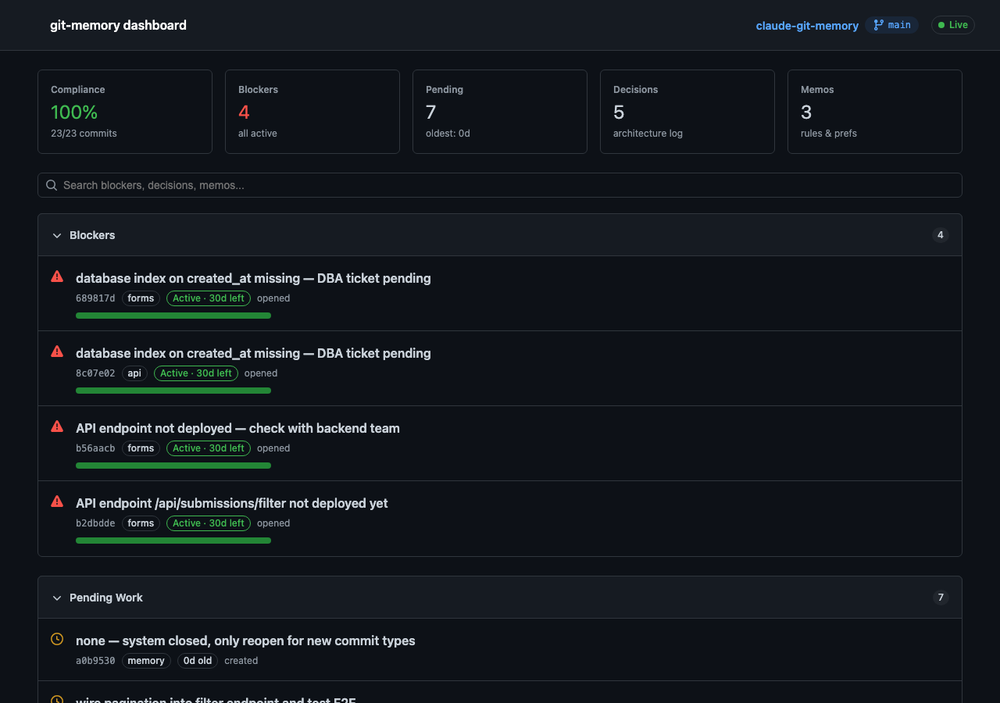

<p align="center">
  
</p>

<h1 align="center">claude-git-memory</h1>

<p align="center">
  <strong>Persistent memory for Claude Code, stored in git.</strong><br>
  <em>Decisions, preferences, blockers, and pending work survive across sessions, machines, and context resets.</em>
</p>

<p align="center">
  <a href="#the-problem">Problem</a> &nbsp;·&nbsp;
  <a href="#how-it-works">How it works</a> &nbsp;·&nbsp;
  <a href="#quick-start">Quick start</a> &nbsp;·&nbsp;
  <a href="#cli-reference">CLI</a> &nbsp;·&nbsp;
  <a href="#dashboard">Dashboard</a> &nbsp;·&nbsp;
  <a href="#garbage-collector">GC</a>
</p>

---

## The problem

Every time Claude starts a new session, it forgets everything:

- *Who decided to use dayjs instead of moment?*
- *What's the user's preference for arrow functions?*
- *What's blocking the deployment right now?*

You end up repeating yourself, re-explaining decisions, and watching Claude reinvent wheels.

## How it works

**Git = Memory.** Every commit carries structured trailers that Claude reads on session start. No external files, no databases — everything lives in the commit history.

```
✨ feat(forms): add date range validation

Issue: CU-042
Why: users submit impossible date ranges crashing the report engine
Touched: src/forms/DateFilter.vue, tests/forms/dateFilter.test.ts
Decision: use dayjs over moment — moment is deprecated and 10x heavier
Next: wire validation into the API layer
```

**Claude writes these automatically.** When you say "let's go with dayjs", Claude creates a `decision()` commit. When you say "never use sync fs", Claude creates a `memo()`. You don't write trailers by hand — you just talk.

When Claude starts a new session, it reads the last 30 commits and shows you a resume:

```
┌──────────────────────────────────────────────────────────┐
│  Branch: feat/CU-042-filters                             │
│  Last session: "pause forms refactor" (2h ago)           │
│  Pending: wire validation into API layer                 │
│  Decision: (forms) use dayjs over moment                 │
│  Memo: (api) never use sync fs operations                │
└──────────────────────────────────────────────────────────┘
```

No questions. It knows where you left off.

### Four hooks protect the system

| Hook | When | What it does |
|------|------|-------------|
| **Belt** | Before `git commit` | Blocks commits missing required trailers |
| **Suspenders** | After `git commit` | Safety net — resets bad commits that slip through |
| **DoD** | Session exit | Blocks exit if there's uncommitted work or pending tasks |
| **Hippocampus** | Context compression | Saves a compact memory snapshot before the LLM loses context |

Handles `fixup!`, `squash!`, merges, reverts, and shallow clones transparently.

---

## Quick start

### 1. Clone and copy into your project

```bash
git clone https://github.com/unmasSk/claude-git-memory.git
cd claude-git-memory

# Copy the memory system into your project
cp -r .claude/ /path/to/your-project/.claude/
cp CLAUDE.md /path/to/your-project/
cp -r bin/ /path/to/your-project/bin/
```

### 2. Register hooks in Claude Code

Add this to your project's `.claude/settings.json` (create it if it doesn't exist):

```json
{
  "hooks": {
    "PreToolUse": [
      {
        "matcher": "Bash",
        "hooks": [{ "type": "command", "command": "python3 .claude/hooks/pre-validate-commit-trailers.py" }]
      }
    ],
    "PostToolUse": [
      {
        "matcher": "Bash",
        "hooks": [{ "type": "command", "command": "python3 .claude/hooks/post-validate-commit-trailers.py" }]
      }
    ],
    "Stop": [
      {
        "hooks": [{ "type": "command", "command": "python3 .claude/hooks/stop-dod-check.py" }]
      }
    ],
    "PreCompact": [
      {
        "hooks": [{ "type": "command", "command": "python3 .claude/hooks/precompact-snapshot.py" }]
      }
    ]
  }
}
```

### 3. Add the CLI to your PATH

```bash
# Add to your .bashrc / .zshrc for persistence:
export PATH="/path/to/your-project/bin:$PATH"
```

### 4. Verify

```bash
git memory boot
```

You should see something like:

```
=== BOOT — Memory Summary ===
Branch: main
Last context: a1b2c3d context(api): pause refactor
Pending (Next:): wire validation into the API layer
Active decisions: (forms) use dayjs over moment
Active memos: (api) preference - never use sync fs operations
```

**Requirements:** Python 3.10+, Git, [Claude Code](https://docs.anthropic.com/en/docs/claude-code) with hooks support.

---

## Commit types

Claude creates these automatically from your conversations:

### Code commits (`feat`, `fix`, `refactor`, `perf`, `chore`, `ci`, `test`, `docs`)

```
✨ feat(auth): add OAuth2 login flow

Why: users need to sign in with Google accounts
Touched: src/auth/oauth.ts, src/routes/login.ts
Issue: CU-101
```

Required: `Why:` + `Touched:` (+ `Issue:` if branch has one)

### Context bookmarks — `context(scope)`

Created when you pause work or end a session:

```
💾 context(api): pause — switching to urgent bugfix

Why: need to handle prod incident before continuing API refactor
Next: finish rate limiting middleware after bugfix
```

Required: `Why:` + `Next:`

### Decisions — `decision(scope)`

Created when you say "let's go with X" or "decidido X":

```
🧭 decision(auth): use JWT over session cookies

Why: API needs to be stateless for horizontal scaling
Decision: JWT with 15min access + 7d refresh tokens
```

Required: `Why:` + `Decision:`

### Memos — `memo(scope)`

Created when you say "always X", "never Y", or "the client wants Z":

```
📌 memo(api): preference — always use async/await over .then() chains

Memo: preference - async/await is more readable, team standard
```

Required: `Memo:` with category (`preference`, `requirement`, or `antipattern`)

### WIP — temporary checkpoints

```
🚧 wip: half-done login form
```

No trailers required. Feature branches only.

---

## CLI reference

### `git memory boot` — session resume

```bash
$ git memory boot
=== BOOT — Memory Summary ===
Branch: feat/CU-042-filters
Pending (Next:): wire validation into API layer
Active decisions: (forms) use dayjs over moment
Active memos: (api) preference - never use sync fs operations
```

### `git memory decisions` — architecture decisions

```bash
$ git memory decisions
a1b2c3d 🧭 decision(auth): use JWT over session cookies
Why: API needs to be stateless for horizontal scaling
Decision: JWT with 15min access + 7d refresh tokens
---
f4e5d6c 🧭 decision(forms): use dayjs over moment
Why: moment is deprecated and 10x heavier
Decision: use dayjs for all date operations
---
```

### `git memory pending` — unfinished work

```bash
$ git memory pending
c7d8e9f 💾 context(api): pause refactor
Next: finish rate limiting middleware
---
a1b2c3d ✨ feat(forms): add date range validation
Next: wire validation into the API layer
---
```

### `git memory search <term>` — find anything

```bash
$ git memory search "dayjs"
=== Decisions ===
  f4e5d6c decision(forms): use dayjs over moment
=== Memos ===
  (none)
=== Pending ===
  (none)
```

### `git memory dashboard` — visual dashboard

```bash
$ git memory dashboard
🧠 Scanning git history...
   47 commits scanned
✅ Dashboard: .claude/dashboard.html
   Opened in browser
```

### `git memory gc` — garbage collector

```bash
$ git memory gc --dry-run
=== git memory gc ===
Scanning last 200 commits (blocker TTL: 30 days)...

🧹 Found 2 candidate(s) for cleanup:

  1. ✅ [Resolved-Next] wire validation into API layer
     Reason: keyword overlap (3 words)
     Evidence: → a1b2c3d feat(forms): add API validation

  2. ⏰ [Stale-Blocker] waiting for design team approval
     Reason: >45 days old, no recent mention

(dry-run mode — no changes made)
```

---

## Dashboard

A self-contained static HTML dashboard using the GitHub Primer dark theme. No server, no dependencies — just one file.

```bash
git memory dashboard
```

<p align="center">
  
</p>

Shows 7 sections: active blockers with TTL bars, pending tasks by age, decisions per scope, memos by category, compliance health, GC status, and commit timeline.

**Auto-updates:** After every commit, the post-hook regenerates the dashboard in the background. The HTML auto-reloads every 10 seconds. Open it once and forget about it.

**State preserved:** Search queries, scroll position, and collapsed sections persist across reloads.

---

## Garbage collector

Stale `Next:` and `Blocker:` items accumulate over time. The GC cleans them using three heuristics:

| Heuristic | Detects |
|-----------|---------|
| **H1** — keyword overlap | `Next:` items already done (subsequent commits share keywords) |
| **H2** — TTL expiry | `Blocker:` items older than 30 days with no recent mention |
| **H3** — explicit resolution | Items referenced by a `Resolution:` trailer |

```bash
git memory gc              # Interactive — asks before cleaning
git memory gc --dry-run    # Preview what would be cleaned
git memory gc --auto       # Clean without asking
git memory gc --days 60    # Custom blocker TTL (default: 30)
```

The GC creates a commit with tombstone trailers (`Resolved-Next:`, `Stale-Blocker:`) that hide cleaned items from future snapshots and dashboard. Reversible with `git revert`.

---

## Conversational capture

You don't need to learn any syntax. Claude detects intent from natural language:

| You say | Claude does |
|---------|-------------|
| "let's go with X" / "decidido X" | Creates a `decision()` commit |
| "always use X" / "never use Y" | Creates a `memo(preference)` |
| "the client requires X" | Creates a `memo(requirement)` |
| "don't ever do X again" | Creates a `memo(antipattern)` |
| "I need to stop here" | Creates a `context()` bookmark |

---

## Trailers reference

| Trailer | Format | Used in |
|---------|--------|---------|
| `Why:` | Free text | All commits (except `wip`) |
| `Touched:` | `path1, path2` or `glob/*` | Code commits |
| `Decision:` | Free text | `decision()` commits |
| `Memo:` | `preference\|requirement\|antipattern - text` | `memo()` commits |
| `Next:` | Free text | Pending work items |
| `Blocker:` | Free text | What blocks progress |
| `Issue:` | `CU-xxx` or `#xxx` | Auto-extracted from branch name |
| `Risk:` | `low\|medium\|high` | Dangerous operations |
| `Conflict:` | Free text | Merge conflict context |
| `Resolution:` | Free text | How a conflict was resolved |
| `Refs:` | URLs, doc links | External references |

---

## Project structure

```
.claude/
├── hooks/
│   ├── pre-validate-commit-trailers.py   # Belt — blocks bad commits
│   ├── post-validate-commit-trailers.py  # Suspenders — safety net + dashboard regen
│   ├── precompact-snapshot.py            # Saves memory before context compression
│   └── stop-dod-check.py                # Blocks exit with pending work
└── skills/
    └── git-memory/
        ├── SKILL.md        # AUTO-BOOT, search protocol, triggers
        ├── WORKFLOW.md     # Branches, commits, trailers
        ├── RELEASE.md      # Release promotions and hotfixes
        ├── CONFLICTS.md    # Conflict resolution with audit trail
        └── UNDO.md         # Recovery with risk tagging
bin/
├── git-memory              # CLI entry point
├── git-memory-gc.py        # Garbage collector
└── git-memory-dashboard.py # Dashboard generator
dashboard-preview.html      # HTML template (GitHub Primer dark theme)
tests/
└── drift-test.py           # Stress test: 200 commits, 6 months, 9 validations
```

---

## Testing

The drift test generates 200 commits across 6 months and validates the entire system:

```bash
$ python3 tests/drift-test.py

DRIFT TEST: ALL PASSED ✓
  1. Deep search finds all decisions/memos across full history
  2. Dedup preserves entries from different scopes
  3. Snapshot budget ≤18 lines (normal + stress)
  4. Long values truncated in snapshot
  5. Hooks handle fixup!/squash!/merge/revert correctly
  6. Post-hook safety (no destructive reset on failures)
  7. Pipes in commit messages don't break the parser
  8. Nested prefixes (squash! fixup! feat:) parse correctly
  9. GC tombstones suppress resolved items from snapshot
```

---

<p align="center">
  <strong>MIT License</strong><br>
  <em>Built for Claude Code.</em>
</p>
